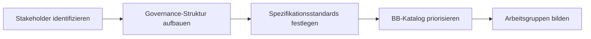
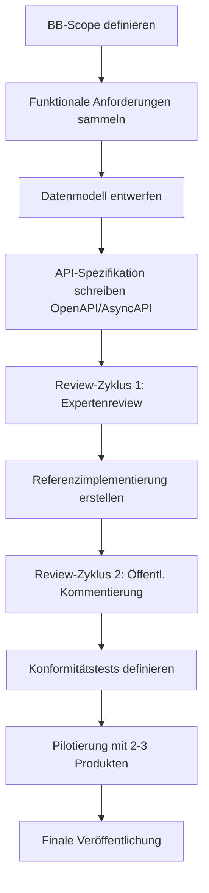

# Verwaltungsdigitalisierungs-Stack – Spezifikation

> **Version:** 0.1 DRAFT  
> **Stand:** 2026-02-21  
> **Status:** Entwurf zur Diskussion

---

## 1  Executive Summary

Dieses Dokument beschreibt einen **modularen, schnittstellenbasierten Stack** zur Beschleunigung der Verwaltungsdigitalisierung. Analog zum internationalen [GovStack-Ansatz](https://specs.govstack.global/) werden **Building Blocks (BB)** definiert – austauschbare, lose gekoppelte Komponenten mit verbindlichen API-Schnittstellen.

### Kern-Ziele

| # | Ziel | Wie der Stack es adressiert |
|---|------|-----------------------------|
| 1 | **Schnelle Digitalisierung** | Zentrale Basiskomponenten → Projekte fokussieren auf Fachlogik |
| 2 | **Kein Vendor Lock-in** | Verbindliche Schnittstellen → Komponenten austauschbar |
| 3 | **Ökosystem & Wettbewerb** | Offene Specs → jeder Marktteilnehmer kann compliant-Produkte anbieten |
| 4 | **Semantische Informationen** | Linked Data & Knowledge Graphs → KI-Readiness |

---

## 2  Architekturprinzipien

### 2.1  Leitparadigmen

| Paradigma | Umsetzung im Stack |
|-----------|---------------------|
| **API First** | Jeder BB wird primär über seine REST/gRPC-API definiert; OpenAPI 3.1 als verbindliches Spezifikationsformat |
| **Zero Trust** | Kein implizites Vertrauen; jede Anfrage wird authentifiziert, autorisiert und verschlüsselt (mTLS, Token-basiert) |
| **Cloud Native** | Container-basiert (OCI), Kubernetes-orchestriert, 12-Factor-App-Prinzipien |
| **Serviceorientierung & Lose Kopplung** | Asynchrone Kommunikation via Event-Bus; synchrone Kommunikation nur bei fachlicher Notwendigkeit |
| **Wiederverwendbarkeit & Portierbarkeit** | Multi-Cloud-fähig; keine proprietären Cloud-Services in BB-Kernlogik |
| **Prefer Buy over Make** | Standardsoftware bevorzugt; Eigenentwicklung nur bei fehlendem Marktangebot |
| **Digitale Souveränität** | Open Source bevorzugt; proprietäre Lösungen nur mit offenen Schnittstellen |
| **Secure AI & Human in the Loop** | KI-Einsatz nur mit Audit-Trail, Explainability und menschlicher Letztentscheidung |

### 2.2  Cross-Cutting Requirements (für alle BBs)

Jeder Building Block MUSS folgende Querschnittsanforderungen erfüllen:

1. **Sicherheit**: OAuth 2.0 / OIDC-basierte Authentifizierung, RBAC/ABAC-Autorisierung, Verschlüsselung at-rest und in-transit
2. **Beobachtbarkeit**: OpenTelemetry-kompatible Traces, Metrics und strukturiertes Logging
3. **Verfügbarkeit**: Definiertes SLA (mindestens 99,5 %), Health-Endpoints, Graceful Degradation
4. **Datenschutz**: DSGVO-Konformität, Privacy by Design, Datensparsamkeit
5. **Barrierefreiheit**: WCAG 2.2 AA für alle UI-Komponenten, BITV 2.0
6. **Interoperabilität**: Verbindliche API-Versionierung (Semantic Versioning), Abwärtskompatibilität für min. 2 Major-Versionen
7. **Auditierbarkeit**: Revisionssichere Protokollierung aller schreibenden Operationen
8. **Mandantenfähigkeit**: Multi-Tenant oder tenant-isoliert je nach BB-Kategorie
9. **Internationalisierung**: UTF-8, Mehrsprachigkeit (min. DE, EN)
10. **Semantik**: Standarddatenformate (XÖV, FIM, JSON-LD); maschinenlesbare Metadaten

---

## 3  Stack-Architektur – Schichtenmodell

```
┌─────────────────────────────────────────────────────────────────────┐
│                    ANWENDUNGS- / FACHVERFAHRENSSCHICHT              │
│          (Fachverfahren, Fachanwendungen, Fachportale)              │
├─────────────────────────────────────────────────────────────────────┤
│                    KI & SEMANTIK-SCHICHT                            │
│   (Knowledge Graph, Semantic Mediator, AI-Gateway, ML-Plattform)   │
├─────────────────────────────────────────────────────────────────────┤
│                    INTEGRATIONS- & MEDIATIONSSCHICHT                │
│      (API-Gateway, Event-Bus, Information Mediator, BPM-Engine)    │
├─────────────────────────────────────────────────────────────────────┤
│                    BUILDING BLOCKS (FACHLICHE BASISDIENSTE)         │
│   ┌──────────┬──────────┬──────────┬──────────┬──────────────────┐  │
│   │ Identity │ Portal & │ Postfach │ Payment  │ Wallet (EUDI)    │  │
│   │ (BundID) │ Formulare│ (Elster) │(ePayment)│                  │  │
│   ├──────────┼──────────┼──────────┼──────────┼──────────────────┤  │
│   │ Register │ Consent  │ Messaging│ Signatur │ Scheduler        │  │
│   │ (NOOTS)  │          │          │          │                  │  │
│   ├──────────┼──────────┼──────────┼──────────┼──────────────────┤  │
│   │ CMS      │ DMS/ECM  │ GIS      │ Logging &│ Notification     │  │
│   │          │          │          │ Audit    │ Service           │  │
│   └──────────┴──────────┴──────────┴──────────┴──────────────────┘  │
├─────────────────────────────────────────────────────────────────────┤
│                    PLATTFORM- & SICHERHEITSSCHICHT                  │
│  (IAM, Secret Mgmt, Policy Engine, Certificate Mgmt, SIEM)        │
├─────────────────────────────────────────────────────────────────────┤
│                    INFRASTRUKTUR / CLOUD-SCHICHT                    │
│  (Container Runtime, Kubernetes, Networking, Storage, DB-as-a-Svc) │
└─────────────────────────────────────────────────────────────────────┘
```

---

## 4  Building Block Katalog

### 4.1  Bestehende Komponenten (Mapping)

| BB-Kategorie | Vorhandene Komponente | Status | Handlungsbedarf |
|-------------|----------------------|--------|-----------------|
| Cloud Infrastructure | Cloud Services | ✅ Vorhanden | API-Standardisierung gemäß SCS/Gaia-X |
| Portal & Formularmanagement | Zentrale Portalplattform | ✅ Vorhanden | Native-App-Ergänzung; API-First-Anbindung spezifizieren |
| Identity | Identity-Lösung | ✅ Vorhanden | OIDC/SAML-Schnittstellen prüfen; eIDAS 2.0-Kompatibilität |
| Messaging / Postfach | Postfach | ✅ Vorhanden | Standardisierte Benachrichtigungs-API definieren |
| Payment | e-Payment | ✅ Vorhanden | Payment-BB-API gemäß XFinanz/XRechnung spezifizieren |
| Wallet | EUDI Wallet | ✅ Vorhanden | Verifiable Credentials-Schnittstelle nach eIDAS 2.0 |
| Digital Registries | NOOTS | ✅ Vorhanden | Registermodernisierungsgesetz-konform; OOTS-Anbindung |

### 4.2  Zu ergänzende Building Blocks

| BB-Kategorie | Beschreibung | Priorität |
|-------------|--------------|-----------|
| **API-Gateway & Information Mediator** | Zentraler Vermittler für BB-zu-BB-Kommunikation; Routing, Rate-Limiting, Versionierung | 🔴 Kritisch |
| **Event-Bus / Async Messaging** | Entkopplung über Events (CloudEvents-Standard); AMQP/Kafka | 🔴 Kritisch |
| **Consent Management** | DSGVO-konforme Einwilligungsverwaltung; granulare Zweckbindung | 🔴 Kritisch |
| **E-Signatur** | QES/FES gemäß eIDAS; Integration mit EUDI Wallet | 🟡 Hoch |
| **BPM/Workflow Engine** | BPMN 2.0-basierte Prozessorchestrierung; DMN für Entscheidungslogik | 🟡 Hoch |
| **Dokumenten-Management (DMS/ECM)** | Revisionssichere Ablage; XDomea-Schnittstelle | 🟡 Hoch |
| **CMS** | Content-Bereitstellung für Portal und App | 🟡 Hoch |
| **Notification Service** | Multi-Kanal-Benachrichtigung (E-Mail, SMS, Push, Postfach) | 🟡 Hoch |
| **KI/AI-Gateway** | Zentrale Inference-API; Modellregistry; Guardrails; Human-in-the-Loop | 🟡 Hoch |
| **Semantik / Knowledge Graph** | OWL/SKOS-Ontologien; SPARQL-Endpoint; Linked-Data-Fähigkeit | 🟡 Hoch |
| **Scheduler** | Terminmanagement; Ressourcenplanung; iCal-Schnittstelle | 🟢 Normal |
| **GIS** | Geoinformationsdienste; OGC-WMS/WFS-konform | 🟢 Normal |
| **Logging, Audit & Compliance** | Zentralisiertes SIEM; GDPR-Audit-Trail | 🟢 Normal |

---

## 5  Spezifikationsstruktur je Building Block

Analog zu GovStack folgt jeder BB derselben Spezifikationsstruktur:

### 5.1  Template

```
BB-Spezifikation: [Name]
├── 1  Versionshistorie
├── 2  Beschreibung
│     ├── 2.1  Zweck und Kontext
│     ├── 2.2  Architekturübersicht (Komponentendiagramm)
│     └── 2.3  Abgrenzung (In-Scope / Out-of-Scope)
├── 3  Begriffe & Definitionen
├── 4  Schlüsselfunktionalitäten (Key Digital Functionalities)
├── 5  Querschnittsanforderungen (Cross-Cutting Requirements)
│     ├── 5.1  Sicherheitsanforderungen
│     ├── 5.2  Datenschutzanforderungen
│     ├── 5.3  Barrierefreiheit
│     ├── 5.4  Observability & Monitoring
│     └── 5.5  SLA-Anforderungen
├── 6  Funktionale Anforderungen
│     ├── 6.x  [Funktionsbereich] (MUSS/SOLL/KANN gemäß RFC 2119)
│     └── ...
├── 7  Datenmodell
│     ├── 7.1  Entitäten & Attribute (JSON Schema / XÖV)
│     ├── 7.2  Semantische Annotationen (JSON-LD / RDF)
│     └── 7.3  Beziehungen zu anderen BBs
├── 8  Service-APIs
│     ├── 8.1  API-Übersicht
│     ├── 8.2  OpenAPI 3.1 Spezifikation
│     ├── 8.3  AsyncAPI Spezifikation (falls Events)
│     ├── 8.4  Authentifizierung & Autorisierung
│     └── 8.5  Fehlerbehandlung & Statuscodes
├── 9  Interne Workflows (BPMN-Diagramme)
├── 10 Konformitätskriterien (Compliance Test Suite)
│     ├── 10.1  MUSS-Kriterien für Stack-Konformität
│     ├── 10.2  Testplan & Testfälle
│     └── 10.3  Zertifizierungsprozess
└── 11 Referenzen & Ressourcen
      ├── 11.1  Relevante Standards (XÖV, FIM, eIDAS etc.)
      ├── 11.2  Referenzimplementierungen
      └── 11.3  Mapping zu GovStack-BBs
```

### 5.2  Konformitätsstufen

| Stufe | Bezeichnung | Beschreibung |
|-------|------------|--------------|
| **Level 1** | API-Compliant | Produkt implementiert die Pflicht-APIs korrekt |
| **Level 2** | Feature-Complete | Alle MUSS- und SOLL-Anforderungen erfüllt |
| **Level 3** | Fully Certified | Konformitätstests bestanden; Interop-Tests mit Referenzumgebung |

---

## 6  Vorgehensmodell zur Spezifikationserstellung

### Phase 1: Vorbereitung & Governance (Monate 1–2)



**Aktivitäten:**
1. **Governance-Gremium** einrichten (Architekturboard) mit Vertretern aus:
   - Bund, Länder, Kommunen
   - IT-Dienstleister (FITKO, Dataport, ITZBund etc.)
   - Industrie & Open-Source-Community
   - Wissenschaft & Standardisierung
2. **Spezifikationsprozess** definieren:
   - RFC-basierter Review-Prozess
   - Versionierung mit Semantic Versioning
   - Öffentliche Kommentierungsfristen (min. 4 Wochen)
3. **Priorisierung** der BBs nach:
   - Abhängigkeitsanalyse (welche BBs werden am häufigsten benötigt?)
   - Reife der bestehenden Komponenten
   - Strategische Bedeutung (KI-Readiness, Once-Only etc.)

### Phase 2: Bestandsaufnahme & Gap-Analyse (Monate 2–4)

**Aktivitäten:**
1. **Ist-Analyse** aller existierenden Komponenten:
   - Aktuelle APIs dokumentieren
   - Schnittstellenqualität bewerten
   - Vendor-Abhängigkeiten identifizieren
2. **Gap-Analyse** gegen GovStack-BB-Katalog und deutschen Rechtsrahmen:
   - Fehlende BBs identifizieren
   - Fehlende Schnittstellen in existierenden BBs
   - Compliance-Lücken (eIDAS 2.0, OZG 2.0, RegMoG)
3. **Referenzarchitektur** erstellen:
   - Schichtenmodell finalisieren
   - BB-Interaktionsdiagramme (Sequence Diagrams)
   - Datenflussdiagramme

### Phase 3: Spezifikation der Querschnittsarchitektur (Monate 3–6)

**Aktivitäten:**
1. **Cross-Cutting Spec** schreiben:
   - Sicherheitsarchitektur (Zero-Trust-Referenzmodell)
   - API-Design-Guidelines (REST-Konventionen, Fehlerformat, Paginierung)
   - Event-Schema-Standard (CloudEvents)
   - Datenstandard-Framework (XÖV-Mapping, JSON-LD-Kontexte)
   - Observability-Standard (OpenTelemetry-Profile)
2. **Semantik-Framework**:
   - Verwaltungs-Ontologie definieren (auf Basis FIM, XÖV)
   - JSON-LD-Kontexte für alle BBs
   - SPARQL-Endpoint-Spezifikation
3. **KI-Framework**:
   - AI-Ethics-Guidelines (Responsible AI)
   - Modellkatalog-Spezifikation
   - Guardrails- und Human-in-the-Loop-Spezifikation
   - Audit-Trail-Format für KI-Entscheidungen

### Phase 4: BB-Spezifikation (iterativ, Monate 4–12)

**Vorgehen pro Building Block:**



**Empfohlene Reihenfolge (nach Abhängigkeit):**

| Wave | Building Blocks | Begründung |
|------|----------------|------------|
| **Wave 1** | API-Gateway, IAM/Identity, Event-Bus | Infrastruktur-BBs, von allen anderen benötigt |
| **Wave 2** | Portal, Postfach, Payment, Consent | Bestehende Komponenten → Schnittstellennormierung |
| **Wave 3** | NOOTS/Register, Wallet, E-Signatur | Registermodernisierung und eIDAS 2.0 |
| **Wave 4** | BPM, DMS, CMS, Notification | Prozess- und Dokumenten-BBs |
| **Wave 5** | KI-Gateway, Semantik, GIS, Scheduler | Innovations-BBs |

### Phase 5: Konformitäts- & Zertifizierungsprogramm (ab Monat 10)

**Aktivitäten:**
1. **Test-Suite** pro BB entwickeln (automatisiert, OpenAPI-basiert)
2. **Referenzumgebung** aufbauen (Sandbox mit allen BBs)
3. **Zertifizierungsprozess** definieren:
   - Self-Assessment (Level 1)
   - Testausführung gegen Referenz-Test-Suite (Level 2)
   - Interoperabilitätstest mit Referenzumgebung (Level 3)
4. **Marketplace/Katalog** für konforme Produkte

### Phase 6: Pilotierung & Iteration (ab Monat 12)

**Aktivitäten:**
1. **Pilot-Fachverfahren** mit dem Stack realisieren (2–3 Use Cases)
2. **Feedback** sammeln und in Spezifikation einarbeiten
3. **Community-Events** (Hackathons, Interop-Plugfests)
4. **Regelmäßiger Release-Zyklus** (halbjährlich)

---

## 7  Schnittstellenstrategie & Vendor-Neutralität

### 7.1  API-Verbindlichkeit

```
┌─────────────────────────────────────────────────────┐
│              SCHNITTSTELLEN-PYRAMIDE                 │
│                                                     │
│         ┌─────────────────────┐                     │
│         │    OpenAPI 3.1      │  ← Normativ          │
│         │  (REST-Schnittstelle)│                     │
│         ├─────────────────────┤                     │
│         │   AsyncAPI 3.0     │  ← Normativ           │
│         │  (Event-Schnittstelle)│                    │
│         ├─────────────────────┤                     │
│         │   JSON Schema       │  ← Normativ          │
│         │  (Datenformate)     │                     │
│         ├─────────────────────┤                     │
│         │   JSON-LD Kontexte  │  ← Normativ          │
│         │  (Semantik)         │                     │
│         ├─────────────────────┤                     │
│         │   OAuth 2.0 / OIDC  │  ← Normativ          │
│         │  (Security)         │                     │
│         └─────────────────────┘                     │
│                                                     │
│  Normativ = MUSS implementiert werden für           │
│             Stack-Konformität                        │
└─────────────────────────────────────────────────────┘
```

### 7.2  Austauschbarkeits-Garantie

- Jeder BB wird **ausschließlich** über seine normativen APIs angesprochen
- Keine direkte DB-Kopplung zwischen BBs
- Adapter-Pattern für Legacy-Integration
- Conformance-Test-Suite stellt sicher, dass alternative Implementierungen sich identisch verhalten

---

## 8  KI & Semantik-Strategie

### 8.1  Semantic Layer

| Aspekt | Spezifikation |
|--------|--------------|
| Ontologie-Basis | FIM (Föderales Informationsmanagement) + Schema.org |
| Serialisierungsformat | JSON-LD (primär), RDF/Turtle (sekundär) |
| Abfrage | SPARQL 1.1, GraphQL-Federation |
| Vokabulare | DCAT-AP.de (Daten), XÖV (Fachverfahren), SKOS (Taxonomien) |
| Bereitstellung | Jeder BB MUSS JSON-LD-Kontext für seine Entitäten bereitstellen |

### 8.2  AI-Readiness-Anforderungen

| Anforderung | Details |
|-------------|---------|
| **Maschinenlesbare Daten** | Jeder BB stellt strukturierte Daten mit semantischen Annotationen bereit |
| **AI-Gateway** | Zentrale Schnittstelle für LLM/ML-Modelle mit Guardrails |
| **Audit-Trail** | Jede KI-Entscheidung wird revisionssicher protokolliert |
| **Human-in-the-Loop** | Konfigurierbare Schwellenwerte für menschliche Überprüfung |
| **Explainability** | KI-Ergebnisse MÜSSEN Erklärungskomponente enthalten |
| **Bias-Monitoring** | Regelmäßige Fairness-Audits; Monitoring-Dashboard |
| **Datensouveränität** | Training nur mit genehmigten Daten; kein Abfluss an Dritte |

---

## 9  Mapping zu GovStack

| GovStack Building Block | Stack-Äquivalent | Anmerkung |
|------------------------|-------------------|-----------|
| Cloud Infrastructure | Cloud Services | ✅ vorhanden |
| Identity | Identity (BundID) | ✅ vorhanden |
| Payments | e-Payment | ✅ vorhanden |
| Wallet | EUDI Wallet | ✅ vorhanden |
| Digital Registries | NOOTS | ✅ vorhanden |
| Messaging | Postfach + Notification Service | ✅ teilweise vorhanden |
| Registration | Portal & Formularmanagement | ✅ vorhanden |
| Consent | Consent Management | ❌ zu ergänzen |
| E-Signature | E-Signatur-BB | ❌ zu ergänzen |
| Information Mediator | API-Gateway + Event-Bus | ❌ zu ergänzen |
| Content Management System | CMS-BB | ❌ zu ergänzen |
| Scheduler | Scheduler-BB | ❌ zu ergänzen |
| GIS | GIS-BB | ❌ zu ergänzen |
| E-Marketplace | *(optional, nicht im initialen Scope)* | – |
| *(Kein GovStack-Äquivalent)* | KI/AI-Gateway + Semantic Layer | 🆕 Erweiterung |
| *(Kein GovStack-Äquivalent)* | BPM/Workflow Engine | 🆕 Erweiterung |
| *(Kein GovStack-Äquivalent)* | DMS/ECM | 🆕 Erweiterung |

---

## 10  Rechtlicher & Normativer Rahmen

| Regelwerk | Relevanz |
|-----------|----------|
| **OZG 2.0** | Verpflichtung zur Digitalisierung; Once-Only-Prinzip |
| **RegMoG** (Registermodernisierungsgesetz) | Registervernetzung über NOOTS |
| **eIDAS 2.0** | EUDI Wallet, QES, Verifiable Credentials |
| **DSGVO/BDSG** | Datenschutz, Consent, Privacy by Design |
| **IT-Sicherheitsgesetz 2.0** | Sicherheitsanforderungen für KRITIS |
| **BSI-Grundschutz / C5** | Cloud-Sicherheitsstandards |
| **EfA-Prinzip** | Einer-für-Alle → Wiederverwendung |
| **SDG-VO** | Single Digital Gateway; grenzüberschreitende Dienste |
| **AI Act (EU)** | Risikokategorien, Transparenzpflichten |
| **Barrierefreiheitsstärkungsgesetz** | Digitale Barrierefreiheit ab 2025 |

---

## 11  Nächste Schritte

| # | Aktion | Verantwortlich | Timeline |
|---|--------|---------------|----------|
| 1 | Governance-Struktur und Architekturboard einrichten | Auftraggeber | Monat 1 |
| 2 | Bestehende Komponenten-APIs dokumentieren und bewerten | Technisches Team | Monat 1–2 |
| 3 | Cross-Cutting-Spec (Sicherheit, API-Guidelines, Semantik) erstellen | Architekturteam | Monat 2–4 |
| 4 | Wave-1-BBs spezifizieren (API-Gateway, IAM, Event-Bus) | BB-Arbeitsgruppen | Monat 3–6 |
| 5 | Referenzimplementierung für Wave-1-BBs | Entwicklungsteam | Monat 5–8 |
| 6 | Konformitäts-Test-Suite aufbauen | QA-Team | Monat 6–10 |
| 7 | Pilot-Fachverfahren implementieren | Pilotprojekte | Monat 10–14 |
| 8 | Öffentlichen BB-Katalog / Marketplace aufbauen | Plattformteam | Monat 12+ |

---

## Anhang A: Glossar

| Begriff | Definition |
|---------|-----------|
| **BB** | Building Block – austauschbare, lose gekoppelte Softwarekomponente mit standardisierter API |
| **Stack** | Gesamtheit aller BBs und deren Querschnittsarchitektur |
| **Stack-konform** | Ein Produkt, das die normativen APIs eines BBs korrekt implementiert |
| **Cross-Cutting** | Querschnittsanforderungen, die für alle BBs gelten |
| **Information Mediator** | Zentrale Vermittlungsschicht für BB-zu-BB-Kommunikation |
| **NOOTS** | National Once-Only Technical System – Registervernetzung |
| **FIM** | Föderales Informationsmanagement – Standardisierung von Verwaltungsleistungen |
| **XÖV** | XML in der Öffentlichen Verwaltung – Datenaustauschstandards |

## Anhang B: Referenzen

- [GovStack Technical Specifications](https://specs.govstack.global/)
- [Sovereign Cloud Stack (SCS)](https://scs.community/)
- [Gaia-X Architecture](https://gaia-x.eu/)
- [FIM-Portal](https://fimportal.de/)
- [XÖV-Standards](https://www.xoev.de/)
- [BSI IT-Grundschutz](https://www.bsi.bund.de/grundschutz)
- [eIDAS 2.0 Regulation](https://digital-strategy.ec.europa.eu/en/policies/eidas-regulation)
- [EU AI Act](https://artificialintelligenceact.eu/)
- [CloudEvents Specification](https://cloudevents.io/)
- [OpenTelemetry](https://opentelemetry.io/)
